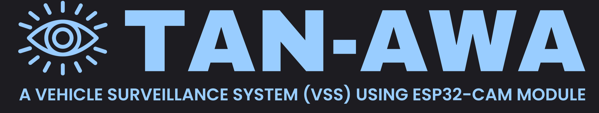
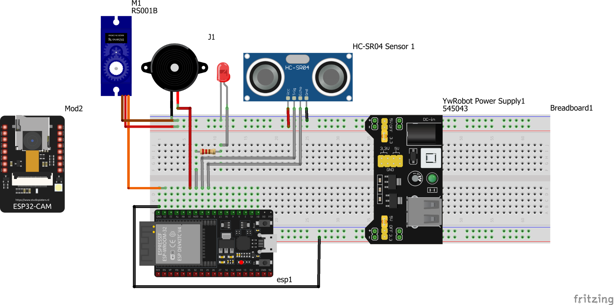

<div align="center">
  
  <h1>Project Tanawa</h1>
  <p>
    An ESP32 + ESP32‑CAM + Python OCR system with Blynk integration for smart gate control and logging.
  </p>
</div>

<p align="center">
  <a href="https://www.python.org/"></a>
  <a href="https://www.arduino.cc/"></a>
  <a href="https://blynk.io/"></a>
  <a href="LICENSE"></a>
</p>

Personal IoT project integrating ESP32, ESP32-CAM, and a Python OCR Flask server, connected to Blynk for control and telemetry. ESP32 detects a vehicle, triggers ESP32‑CAM to capture, ESP32‑CAM POSTs the image to Flask for OCR, results are logged to Google Sheets/Drive and sent back to ESP32 to drive the gate servo.

---

### 🧭 Contents
- [Demo](#demo)
- [Circuit Diagram](#circuit-diagram)
- [Key Features](#key-features)
- [Tech Stack](#tech-stack)
- [Architecture (Overview)](#architecture-overview)
- [API Endpoints](#api-endpoints)
- [Repository Structure](#repository-structure)
- [Requirements](#requirements)
- [Blynk Setup](#blynk-setup)
- [Firmware Setup (ESP32 / ESP32‑CAM)](#firmware-setup-esp32--esp32cam)
- [Python OCR Server Setup](#python-ocr-server-setup)
- [Usage](#usage)
- [Security Notes](#security-notes)
- [Troubleshooting](#troubleshooting)
- [License](#license)
- [Author](#author)

### 📸 Demo
If present, the demo GIF will render below:

<p align="center">
  
</p>

Place your GIF at: `screenshots/demo.gif`.

### 🔌 Circuit Diagram
<p align="center">
  
</p>

### 🌟 Key Features
- **ESP32 telemetry and control**: Ultrasonic detection, buzzer/LED alerts, gate servo.
- **ESP32‑CAM image capture**: On-demand capture endpoint that forwards frames to the server.
- **Python OCR server**: Flask endpoint runs Tesseract OCR, uploads to Google Drive, logs to Google Sheets.
- **Blynk integration**: Virtual pins dashboard and notification on detection.

### 🛠️ Tech Stack
- **Hardware**: ESP32, ESP32‑CAM (AI Thinker)
- **Cloud/App**: Blynk (cloud + mobile app)
- **Firmware**: Arduino/PlatformIO (C/C++)
- **Server**: Python 3.x, Flask, Tesseract OCR, Google Sheets/Drive APIs

### 🧱 Architecture (Overview)
- ESP32: detects vehicle; on detection sends `GET /capture` to ESP32‑CAM; receives OCR via `GET /receive_text?text=...`.
- ESP32‑CAM: handles `GET /capture`, takes a snapshot and POSTs raw JPEG to Flask `POST /capture`.
- Flask OCR server: saves image, runs OCR, overlays text, uploads to Google Drive, appends to Google Sheets, notifies ESP32.
- Blynk: dashboard via virtual pins and an optional `vehicle_detected` event.

### 🔗 API Endpoints
- ESP32‑CAM (port 80): `GET /capture`
- Flask (port 5000): `POST /capture`, `GET /uploads/latest_vehicle_annotated.jpg`
- ESP32 (port 80): `GET /receive_text?text=ABC123`

### 🗂️ Repository Structure
```
firmware/
  esp32/
    main.ino
  esp32-cam/
    main.ino
    camera_pins.h
scripts/
  python/
    main.py
    requirements.txt
screenshots/
  demo.gif
  system-circuit-design.png
```

### 📋 Requirements
- **Hardware**: ESP32 dev board, ESP32‑CAM (OV2640), ultrasonic sensor, servo, buzzer/LED, USB‑TTL as needed.
- **Software**:
  - Arduino IDE (or PlatformIO) with ESP32 board support
  - Blynk account/app and device `BLYNK_AUTH_TOKEN`
  - Python 3.9+ (recommended), Tesseract OCR installed

### 📱 Blynk Setup
1. Create a device in Blynk Cloud and get `BLYNK_AUTH_TOKEN`.
2. Virtual pins used by the firmware:
   - `V0`: timestamp text
   - `V1`: OCR plate text
   - `V2`: servo mode switch (0°/90°)
   - `V3`: manual capture trigger
3. Optional event: `vehicle_detected` for notifications.

### 🔧 Firmware Setup (ESP32 / ESP32‑CAM)
- ESP32 (`firmware/esp32/main.ino`): set `ssid`, `password`, and `BLYNK_AUTH_TOKEN`.
- ESP32‑CAM (`firmware/esp32-cam/main.ino`): set Wi‑Fi creds and `flaskServerUrl` (host:port of Flask).
- Build and upload each sketch using Arduino IDE or PlatformIO.

### 🐍 Python OCR Server Setup
Install Tesseract OCR (update the path in `scripts/python/main.py` if different). Place your Google service account `credentials.json` in repo root.

```bash
python -m venv .venv
.venv\Scripts\activate
pip install -r scripts\python\requirements.txt
python scripts\python\main.py
```

### 🔐 Security Notes
> Do not commit secrets. Keep `credentials.json`, `.env`, and Arduino `secrets.h` out of git. Use `scripts/python/example.env` as a template for your local `.env` and create `secrets.h.example` files for Arduino credentials.

### Usage
1. Start the Flask OCR server on a reachable host (`POST /capture` on port 5000).
2. Power the ESP32‑CAM; test `http://<esp32-cam-ip>/capture` to verify capture + POST.
3. Power the ESP32; it will trigger capture on detection and receive OCR via `/receive_text`.
4. Use the Blynk app to view time (`V0`), plate text (`V1`), toggle servo (`V2`), trigger manual capture (`V3`).

### 🧪 Troubleshooting
- Match all IPs/ports across ESP32, ESP32‑CAM, and Flask server.
- Verify Blynk token, Wi‑Fi credentials, and virtual pin mapping.
- Confirm Tesseract installation path and Google API credentials/permissions.
- If capture fails, reduce ESP32‑CAM `frame_size` or ensure PSRAM is available.

### 📄 License
This project is licensed under the MIT License. See `LICENSE` for details.

### 👤 Author
Reno-03 (2025)


